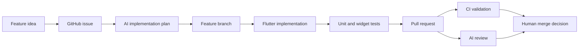

# AI-Assisted Flutter Delivery Case Study

This repository demonstrates a practical delivery model for using AI-assisted
engineering to increase the output of a senior Flutter developer without
removing human ownership from the process.

The client-facing value proposition is:

> I help teams get small-team delivery output from one senior Flutter engineer by
> combining senior product judgment with AI-assisted planning, implementation,
> testing, review, and release workflows.

## Why this exists

Many early-stage teams need mobile delivery but cannot yet afford a full product
team with separate roles for product management, design, Flutter development,
QA, DevOps, and code review.

This project explores how one senior engineer can cover more of that delivery
surface by using AI agents and automation for repeatable workflow steps while
keeping important decisions under human control.

## Demonstrated workflow

The repo is organized to show the complete delivery loop:

1. Product work starts in GitHub Issues.
2. AI helps turn vague scope into an implementation plan.
3. Work lands in focused feature branches.
4. Code follows the existing Flutter architecture.
5. Tests are added with the implementation.
6. Pull requests include summaries and test plans.
7. CI runs format, analyze, and tests.
8. AI review comments provide a second-pass review.
9. A human reviews and merges.

## What has been built

Pulse is a coaching and wellness MVP. It currently demonstrates:

- Onboarding with validation and persisted completion.
- Login UI using MVVM-style state management.
- Theme settings with local persistence.
- Figma-aligned design system with shared Flutter widgets.
- Coaching lesson feed with mock or Supabase catalog.
- Lesson detail screen with video playback support.
- Local saved lessons with SharedPreferences persistence.
- **Supabase auth** (sign-up, email confirmation deep links) and **cloud saved-lessons sync** when signed in.
- Localization-ready user-facing strings.
- CI and test coverage across view models, repositories, and important widgets.

## AI-assisted delivery examples

The project history now includes examples of:

- Design implementation from a Figma Make export.
- Review-note handling after an AI-assisted PR review.
- Merge conflict resolution after stacked PRs landed out of order.
- Feature delivery from issue acceptance criteria.
- Local persistence and UI tests added as part of the same feature PR.

Useful pull requests:

- [#23 Apply Figma design system](https://github.com/srdjan86/pulse_coaching_app/pull/23)
- [#24 Add saved lessons and expand lesson feed](https://github.com/srdjan86/pulse_coaching_app/pull/24)
- [#26 Add Supabase lesson catalog](https://github.com/srdjan86/pulse_coaching_app/pull/26)
- [#28 Supabase auth and saved-lessons sync](https://github.com/srdjan86/pulse_coaching_app/pull/28)

Useful issues:

- [#20 Apply Figma design to Flutter UI](https://github.com/srdjan86/pulse_coaching_app/issues/20)
- [#5 Lesson feed (mock data)](https://github.com/srdjan86/pulse_coaching_app/issues/5)
- [#4 Saved lessons (local)](https://github.com/srdjan86/pulse_coaching_app/issues/4)

## What AI is responsible for

AI is useful for repeatable delivery work:

- Drafting implementation plans.
- Searching the codebase and mapping architecture.
- Generating first-pass feature code.
- Writing focused unit and widget tests.
- Preparing PR descriptions.
- Running validation commands.
- Reviewing diffs for regressions and missing tests.
- Summarizing risks and follow-up work.

## What remains human-owned

AI does not replace senior judgment. The human developer still owns:

- Client communication.
- Scope control.
- Architecture decisions.
- Dependency approval.
- Security and production-risk review.
- Final code review.
- Merge and release decisions.
- Product trade-offs and prioritization.

## Client-facing offer

A concise service description:

> I can take a product idea or feature request and turn it into a planned,
> implemented, tested, reviewed, and release-ready Flutter change using an
> AI-assisted engineering workflow.

The value is:

- Faster delivery.
- Clearer planning.
- Lower coordination overhead.
- Better test discipline.
- A repeatable PR-based workflow.
- Senior Flutter engineering supported by AI automation.
