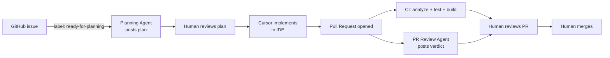

# AI-Assisted Development Workflow

The goal is to use AI to accelerate delivery while keeping senior human control.

## Workflow

1. Create a GitHub issue with a clear title and description.
2. Apply the `ready-for-planning` label → the **Planning Agent** automatically posts an implementation plan as an issue comment.
3. Review the plan. If changes are needed, edit the issue and re-apply the label.
4. Open Cursor and say: *"implement issue #N"* → the **Cursor agent** implements the smallest safe PR.
5. AI adds or updates tests, runs format/analyze/test, opens a PR.
6. CI runs Flutter analyze, test, and build smoke check.
7. The **PR Review Agent** automatically posts a structured review comment.
8. Human reviews both the code and the AI review comment, then merges.

## Automated agents

### Planning Agent (`ready-for-planning` label)

Triggered when an issue is labeled `ready-for-planning`.

- Reads: issue title + body, `AGENTS.md`, `pubspec.yaml`, `app_router.dart`, `service_locator.dart`, Dart file tree
- Posts a plan with 8 sections: summary, files to create, files to modify, architecture impact, state management, test plan, risks, open questions
- Once you've read the plan, open Cursor and implement it — no further label required

### PR Review Agent (automatic on every PR)

Triggered on every PR opened or updated against `develop` or `main`.

- Reads: the PR diff (scoped to `lib/`, `test/`, `.github/`, `scripts/`) and `AGENTS.md`
- Posts a verdict (✅ / ⚠️ / ❌) with findings per category
- The review is advisory — it does not block merging

## Rules

- No direct commits to `develop` or `main` — PRs required for both.
- No AI auto-merge.
- No unapproved dependencies.
- No large unfocused PRs — one concern per PR.
- No production release without human review.

## Implementation prompt (in Cursor)

After reviewing the plan posted by the Planning Agent:

> Implement issue #N. Follow the plan in the issue comments and AGENTS.md. Add tests, run format/analyze/test, open a PR — do not merge.

## Good AI task example

Implement a simple onboarding screen with email input, validation, loading state, and success callback. Follow existing architecture and add widget tests.

## Bad AI task example

Build the whole app.

## Backlog

Track work in **GitHub Issues**. Do not commit ticket markdown under `docs/` — the issue body is the source of truth for scope and acceptance criteria.
