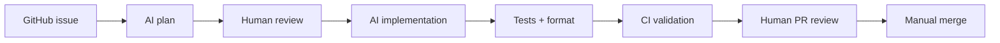

# AI-Assisted Development Workflow

The goal is to use AI to accelerate delivery while keeping senior human control.

## Workflow

1. Create a GitHub issue using the feature template.
2. Ask the AI agent to inspect the repo and propose a plan.
3. Review the plan manually.
4. Ask the AI agent to implement the smallest safe PR.
5. AI adds or updates tests.
6. CI runs format, analyze, test, and build.
7. AI reviews the PR.
8. Human reviews the PR.
9. Merge only after approval.

## Rules

- No direct commits to main.
- No AI auto-merge.
- No unapproved dependencies.
- No large unclear PRs.
- No production release without human review.

## Planning prompt

Before coding, ask the agent:

> Inspect this Flutter repository and the linked GitHub issue. Before coding, create an implementation plan with: summary, files to change, architecture approach, state management, validation, tests, risks, and assumptions. Do not write code yet. Follow AGENTS.md.

## Implementation prompt

After plan approval:

> The implementation plan is approved. Implement as the smallest safe PR. Follow AGENTS.md, add tests, run format/analyze/test, and do not merge.

## Good AI task example

Implement a simple onboarding screen with email input, validation, loading state, and success callback. Follow existing architecture and add widget tests.

## Bad AI task example

Build the whole app.

## Backlog

Track work in **GitHub Issues** (or your team’s issue tracker). Do not commit ticket markdown under `docs/` — the issue body is the source of truth for scope and acceptance criteria.
